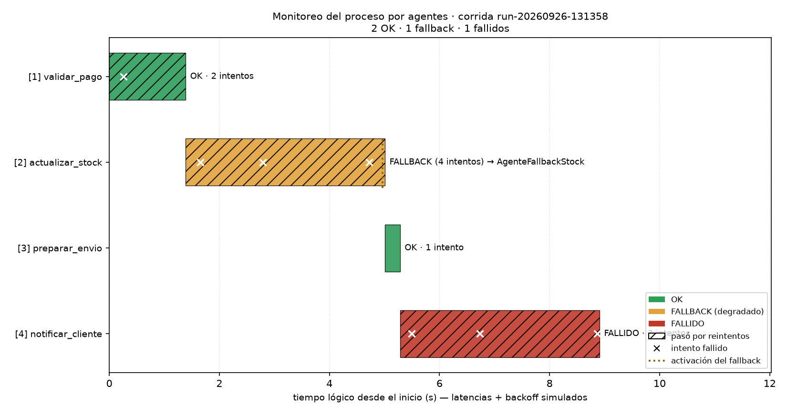

# Sistemas de Automatización con Agentes de IA

Orquestador **multi-agente** que automatiza el procesamiento de un pedido de
una frutería online (validar pago → actualizar stock → preparar envío →
notificar) con **reintentos con backoff exponencial**, **fallback** cuando una
herramienta no responde y **monitoreo** evento por evento.

Todo corre **100% offline con la stdlib de Python** (no usa APIs ni LLMs): las
herramientas están simuladas con semilla fija para que la falla sea reproducible,
pero la lógica de orquestación es real y portable a producción.

## Problema

Una frutería online con un ERP propio procesa cada pedido a mano. El día que
crece aparecen tres problemas operativos:

1. **Pérdida de ventas y reclamos.** Si la pasarela de pagos responde con un 503
   y el proceso aborta, el cliente pagó y no recibe nada. Si el ERP de stock no
   contesta, el pedido queda a medio hacer: ¿se envía o se cancela?
2. **Reintentos ingenuos.** Reintentar sin backoff ni jitter golpea el servicio
   caído y prolonga la caída. Reintentar sin distinguir *error transitorio* de
   *rechazo de negocio* gasta intentos en pagos que nunca van a pasar.
3. **Caja negra.** Cuando algo sale mal nadie sabe cuántos intentos hubo, cuánto
   tardó cada paso ni si el proceso se degradó a un camino manual.

El objetivo no es "un agente que hace de chatbot": es un proceso de negocio
**robusto**, con política de reintentos, degradación explícita y trazabilidad.

## Arquitectura

Cada paso del proceso es un **agente**: una unidad de trabajo con un objetivo
único que llama a una herramienta externa. La clase base `Agente` decide
(latencia, falla, timeout, si el error es reintentable) y el método `ejecutar()`
de cada agente concreto tiene la lógica de negocio.

```text
orquestador.py ── carga config.json, ejecuta los 4 pasos, arma reporte + gráfico
      │
      ├── manejo_errores.ejecutar_con_fallback(acción)   ← política de robustez
      │        └── reintentar(...)  → 3 intentos, backoff exponencial + jitter
      │                 └── on_fallback(...) → ejecuta el agente de respaldo
      │
      ├── agentes.AgenteValidarPago / AgenteActualizarStock
      │   AgentePrepararEnvio / AgenteNotificar / AgenteFallbackStock
      │        └── ejecutar()   ← la "API" real entra acá (ver docs/)
      │
      └── monitoreo.registrar_evento(...)  → outputs/log_ejecucion.jsonl (append)
```

- **Orquestador** (`orquestador.py`): recorre los pasos, aplica los puntos de
  control (si un paso crítico queda FALLIDO aborta el proceso), y genera
  `outputs/reporte_ejecucion.md` y `outputs/diagrama_pasos.png`.
- **Agentes** (`agentes.py`): `Agente` (base) + 5 agentes. Cada uno tiene
  `prob_fallo`, rango de latencia y timeout configurables en `config.json`.
- **Manejo de errores** (`manejo_errores.py`): `reintentar()` y
  `ejecutar_con_fallback()`, con backoff exponencial, jitter, errores tipados
  reintentables / no reintentables y logging de cada intento.
- **Monitoreo** (`monitoreo.py`): `registrar_evento()` escribe una línea JSON
  por evento (append) y `consolidar_log()` arma las métricas por paso.

### config.json (extracto)

La tarea, los agentes y la política viven en un único archivo versionable:

```json
{
  "semilla": 42,
  "reintentos": {
    "max_reintentos": 3,
    "backoff_base": 1.0,
    "estrategia": "exponencial",
    "factor": 2.0,
    "jitter": 0.2
  },
  "agentes": {
    "AgenteValidarPago":    { "prob_fallo": 0.55, "latencia_ms": [120, 340], "timeout_simulado_ms": 500 },
    "AgenteActualizarStock": { "prob_fallo": 0.85, "latencia_ms": [220, 700], "timeout_simulado_ms": 480 },
    "AgentePrepararEnvio":  { "prob_fallo": 0.15, "latencia_ms": [150, 420], "timeout_simulado_ms": 700 },
    "AgenteNotificar":      { "prob_fallo": 0.50, "latencia_ms": [90, 520],  "timeout_simulado_ms": 400 },
    "AgenteFallbackStock":  { "prob_fallo": 0.10, "latencia_ms": [100, 260],  "timeout_simulado_ms": 600 }
  },
  "tarea": {
    "pasos": [
      { "id": 1, "nombre": "validar_pago", "agente": "AgenteValidarPago", "critico": true, "fallback": null },
      { "id": 2, "nombre": "actualizar_stock", "agente": "AgenteActualizarStock", "critico": true,
        "fallback": { "agente": "AgenteFallbackStock", "motivo": "El ERP no respondió tras agotar los reintentos..." } },
      { "id": 3, "nombre": "preparar_envio", "agente": "AgentePrepararEnvio", "critico": true, "fallback": null },
      { "id": 4, "nombre": "notificar_cliente", "agente": "AgenteNotificar", "critico": false, "fallback": null }
    ]
  }
}
```

## Proceso

1. **Validar pago** — `AgenteValidarPago` confirma el cobro con la pasarela.
   *Falla típica*: 503 o timeout del proveedor. Reintentable; **sin fallback**
   (sin pago no se toca el stock, el pedido queda frenado).
2. **Actualizar stock** — `AgenteActualizarStock` descuenta unidades en el ERP.
   *Falla típica*: el ERP no responde o devuelve 503. Es el paso más frágil:
   tras 3 intentos agotados entra el **fallback `AgenteFallbackStock`**, que
   descuenta en la planilla de control manual y abre un ticket de revisión
   humana → el pedido sigue, pero queda trazabilidad y un responsable.
3. **Preparar envío** — `AgentePrepararEnvio` emite la guía y reserva cupo con
   el transportista. Sin stock reservado no arma el envío (error no
   reintentable: el problema es de datos, no del servicio).
4. **Notificar cliente** — `AgenteNotificar` manda el aviso por el canal
   configurado. Es **no crítico**: si falla, el pedido ya está despachado, así
   que el orquestador emite **alerta** para el contacto manual y no frena nada.

Sobre los 4 pasos se aplica siempre:

- **Reintentos**: hasta `max_reintentos=3` intentos por paso.
- **Backoff exponencial con jitter**: `1.0s → 2.0s` (±20%) entre intentos, para
  que todos los pedidos no golpeen el servicio caído al mismo tiempo.
- **Errores tipados**: los reintentables (503, timeout, ECONNRESET) se reintentan;
  los de negocio (pago rechazado, domicilio inválido, stock insuficiente) cortan
  la secuencia en el acto.
- **Puntos de control**: si un paso `critico` queda FALLIDO, el proceso se
  aborta y los pasos siguientes quedan `OMNIDO`.
- **Monitoreo**: un evento JSON por paso, intento, espera de backoff, fallback
  y alerta (`outputs/log_ejecucion.jsonl`, append-only).

## Resultados

Corrida de referencia (`semilla=42`, `python orquestador.py`):

| # | Paso | Agente | Estado | Intentos | Reintentos | Duración | Qué pasó |
|---|---|---|---|---|---|---|---|
| 1 | `validar_pago` | AgenteValidarPago | **OK** | 2 | 1 | 1.39 s | `INDISPONIBLE_PAGO` en el intento 1 → backoff 0.91 s → OK en el 2 |
| 2 | `actualizar_stock` | AgenteActualizarStock | **FALLBACK** | 4 | 2 | 3.62 s | 3 intentos `INDISPONIBLE_ERP` agotados → fallback `AgenteFallbackStock` (planilla manual + ticket `TK-717889`) |
| 3 | `preparar_envio` | AgentePrepararEnvio | **OK** | 1 | 0 | 0.28 s | Guía emitida (EnvíaYa) sin incidentes |
| 4 | `notificar_cliente` | AgenteNotificar | **FALLIDO** | 3 | 2 | 3.62 s | 3 intentos `INDISPONIBLE_NOTIF`; no hay fallback → **alerta** de contacto manual, el proceso no se frena |

- **2 OK · 1 FALLBACK · 1 FALLIDO** → estado del proceso
  `COMPLETADO_CON_ALERTAS`: el pedido se despacha igual, con el stock controlado
  en la planilla manual y el cliente sin aviso automático (contacto manual).
- **10 intentos y 4 reintentos** en total; **3 alertas** (2 WARNING por el
  fallback, 1 ERROR por la notificación).
- **28 eventos** en el log de la corrida (incluye `run_inicio` y `run_fin`); el
  log es append-only, así que las corridas sucesivas se acumulan. La duración
  lógica del proceso es **8.91 s** (latencias + backoffs simulados).
- Todo es **auditable**: el mismo `pedido_id` aparece en todos los eventos, con
  la autorización de pago, la reserva de stock, el número de guía y el ticket
  que dejó el fallback.



> El diagrama muestra la línea de tiempo por paso: color = estado final
> (verde OK, amarillo FALLBACK, rojo FALLIDO), trama = el paso tuvo reintentos,
> cruces = cada intento fallido y la línea punteada = el instante en que se
> activó el fallback. El reporte completo con el árbol de ejecución está en
> [outputs/reporte_ejecucion.md](outputs/reporte_ejecucion.md).

## Cómo reproducir

```bash
pip install -r requirements.txt   # solo matplotlib (el resto es stdlib)
python orquestador.py
```

La corrida es **determinista** (`random.seed(42)`): da el mismo resultado en
cada ejecución. El log es *append*, así que al correrlo de nuevo las corridas
se acumulan (28 eventos la primera vez, 56 la segunda) y se pueden reprocesar
después con `monitoreo.leer_log()` / `monitoreo.consolidar_log()`. Ejemplo de
salida:

```text
[1/4] validar_pago       agente=AgenteValidarPago max_reintentos=3 backoff_base=1.0s
    ✗ intento 1: INDISPONIBLE_PAGO — la herramienta respondió con error transitorio
      ↻ backoff: espera 0.91s antes del reintento (exponencial + jitter)
    ✓ intento 2: OK (169 ms simulados, t=1.34s)
[2/4] actualizar_stock   agente=AgenteActualizarStock max_reintentos=3 backoff_base=1.0s
    ✗ intento 1: INDISPONIBLE_ERP ...
    ⚠ FALLBACK ACTIVADO: el agente principal agotó los reintentos
resumen: 2 OK · 1 fallback · 1 fallidos · 10 intentos (4 reintentos) · 27 eventos
```

Para ver otro escenario, cambiá `semilla` en `config.json`; para cambiar el
reparto de fallas, ajustá `prob_fallo` (y `timeout_simulado_ms`) por agente.

## Estructura

```
agentes-ia-automatizacion/
├── orquestador.py        # MAIN: carga config, ejecuta pasos, reporte + gráfico
├── agentes.py            # clase base Agente + 5 agentes (prob. de fallo por config)
├── manejo_errores.py     # reintentar() y ejecutar_con_fallback() (backoff, jitter)
├── monitoreo.py          # registrar_evento() → JSONL (append) + consolidación
├── config.json           # tarea, agentes, max_reintentos, backoff_base, fallbacks
├── docs/
│   └── ADAPTAR_A_PRODUCCION.md   # cómo mapear cada agente a una API/cola real
├── outputs/              # log_ejecucion.jsonl · reporte_ejecucion.md · diagrama_pasos.png
└── requirements.txt      # matplotlib>=3.8 (el resto es stdlib)
```

## Autor

Juan Pablo Contato — Licenciado en Ciencias de Datos
