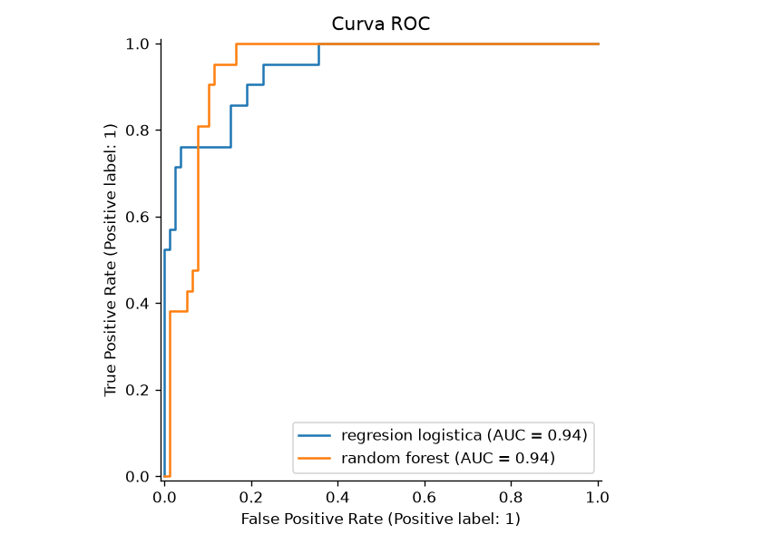
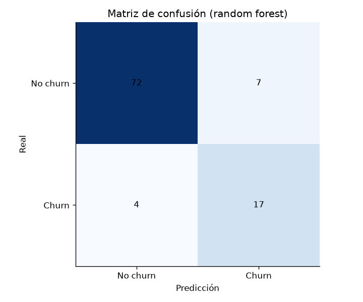

# Customer Churn Prediction

Modelo de **Machine Learning** para predecir qué clientes tienen más riesgo de
abandonar el servicio (churn), comparando **Regresión Logística** vs **Random Forest**.

## Problema

Una empresa de telecomunicaciones quiere **predecir el abandono de clientes**
antes de que ocurra, para poder aplicar acciones de retención focalizadas
(descuentos, soporte, campañas).

## Datos

- Dataset sintético reproducible: 500 clientes, 4 características, ~21% de churn.
- Se genera con `generar_datos.py` (semilla fija para reproducibilidad).
- Características: `edad`, `meses_cliente`, `uso_servicio`, `pago_mensual`.

## Proceso

1. **Datos** (`generar_datos.py`) → genera `churn_dataset.csv` con semilla 42.
2. **Modelos** (`churn_model.py`) → entrena y compara:
   - Regresión Logística (línea base interpretable)
   - Random Forest (más capacidad predictiva)
3. **Evaluación** → accuracy, F1, AUC-ROC, matriz de confusión y curva ROC.
4. **Producción** → el modelo con mejor F1 se guarda en `modelos/modelo_churn.pkl` (joblib).

## Resultados

| Modelo | Accuracy | F1 | AUC-ROC |
|---|---|---|---|
| Regresión Logística | 0.810 | 0.667 | 0.943 |
| Random Forest | 0.890 | 0.756 | 0.942 |

- **Random Forest es el mejor modelo** (F1 0.76) y queda guardado para producción.
- El modelo detecta ~81% de los clientes que se van (recall 0.81 en churn),
  con una precisión del 71% → accionable para campañas de retención.




> Los valores exactos pueden variar levemente entre ejecuciones; se muestran
> los resultados de la corrida de referencia.

## Cómo reproducir

```bash
pip install -r requirements.txt
python generar_datos.py
python churn_model.py
```

## Estructura

```
customer-churn/
├── churn_dataset.csv      # dataset (generado)
├── generar_datos.py       # genera el dataset sintético
├── churn_model.py         # modelos + evaluación + exports
├── modelos/
│   └── modelo_churn.pkl   # mejor modelo listo para producción
├── outputs/               # curva ROC y matriz de confusión
└── requirements.txt
```

## Autor

Juan Pablo Contato — Licenciado en Ciencias de Datos