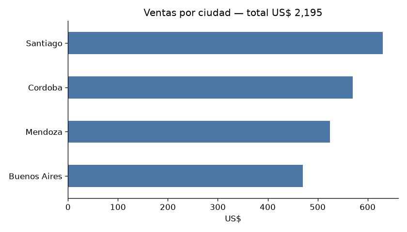
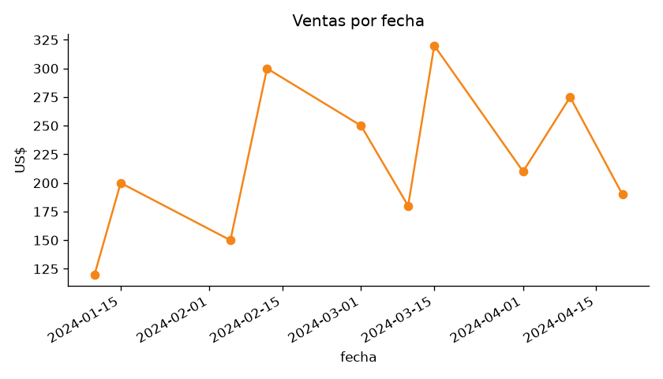

# Dashboard de KPIs de Ventas

Aplicación web interactiva (**Streamlit**) que muestra los indicadores clave de
ventas de un negocio: totales, clientes activos, ticket promedio y evolución
por ciudad y por fecha.

## Problema

El dueño de un negocio necesita **ver sus ventas de un vistazo** para tomar
decisiones. Un dashboard centraliza los KPIs en una sola pantalla accesible.

## Datos

- Dataset sintético de ventas 2024: 10 transacciones, 5 ciudades
  (Santiago, Córdoba, Buenos Aires, Mendoza) y 10 clientes.
- Archivo: `data/ventas.csv`.

## KPIs del dashboard

| KPI | Valor |
|---|---|
| Ventas totales | US$ 2.195 |
| Clientes activos | 10 |
| Ticket promedio | US$ 219.50 |

- Ventas por ciudad (bar chart)
- Ventas por fecha (line chart)
- Detalle de transacciones




## Cómo ejecutar

```bash
pip install -r requirements.txt
streamlit run dashboard_kpis.py
```

Para regenerar las vistas previas PNG (sin desplegar la app):

```bash
python preview.py
```

## Estructura

```
dashboard-kpis/
├── dashboard_kpis.py   # app Streamlit
├── preview.py          # genera PNGs de los KPIs
├── data/
│   └── ventas.csv      # dataset
├── outputs/            # vistas previas
└── requirements.txt
```

## Autor

Juan Pablo Contato — Licenciado en Ciencias de Datos