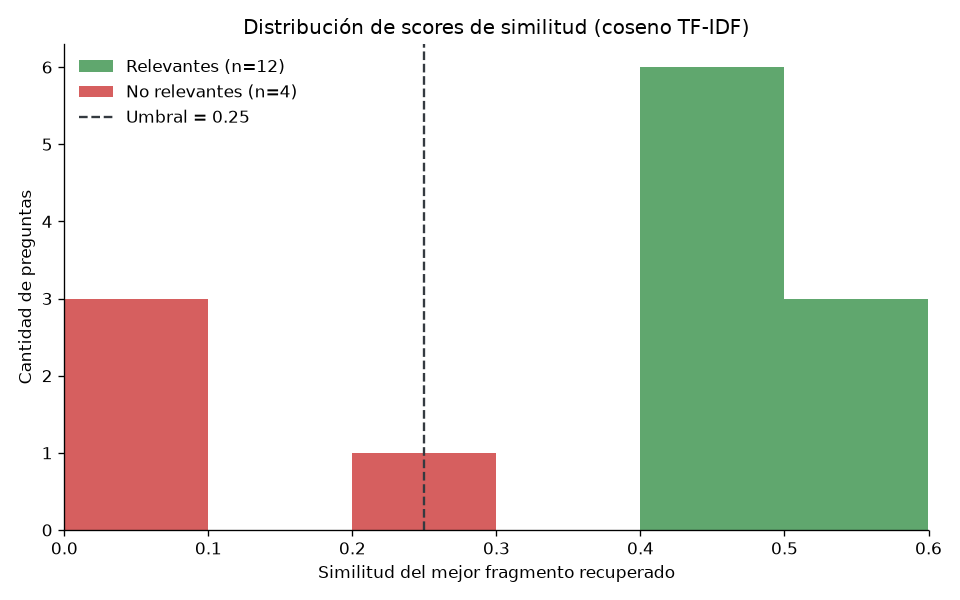

# RAG Asistente Confiable (Frutolandia)

Asistente de preguntas frecuentes con **RAG** (retrieval-augmented generation) que
funciona **100 % local**: recupera evidencia con TF-IDF y scikit-learn, aplica un
**guardrail** que rechaza lo que está fuera de tema y **evalúa** su propia calidad
con métricas de retrieval. La generación con un modelo de chat es **opcional**
(solo si existe `OPENAI_API_KEY`).

## Problema

Una frutería online (**Frutolandia**, ficticia) quiere un asistente que conteste
preguntas de envíos, productos, pagos y devoluciones. Un chatbot conectado a un LLM
"a secas" tiene dos riesgos concretos:

1. **Alucinación**: responde temas que no domina (recetas, impuestos de otros
   países) con datos inventados, y el cliente pierde confianza.
2. **Dependencia de una API**: sin conexión, sin red o sin crédito, el asistente
   deja de servir.

El objetivo es un asistente **confiable**: que responda solo con evidencia
verificada de su base de conocimiento, que se niegue amablemente cuando la consulta
no pertenece al tema, y que funcione aunque no haya ninguna API configurada.

## Datos

- **Base de conocimiento**: 4 documentos Markdown en `datos/conocimiento/`
  (envíos y entregas, productos y stock, pagos y facturación, devoluciones y
  reclamos) con **47 preguntas frecuentes** (11 a 12 por documento).
- **Chunking**: cada bullet `- **¿Pregunta?** Respuesta` es un fragmento
  independiente, con su fuente y sección (47 fragmentos indexados).
- **Set de evaluación** (`datos/preguntas_evaluacion.csv`): **16 preguntas** con
  columnas `pregunta;categoria;relevante;respuesta_esperada`:
  **12 relevantes** (3 por cada tema) y **4 no relevantes** (cocina, impuestos de
  España, cálculo diferencial y hardware) para medir el guardrail.

## Proceso

1. **Indexación** (`construir_indice.py`): parsea los `.md`, sanea el texto
   (minúsculas, sin acentos ni puntuación) y entrena un `TfidfVectorizer` con
   **unigramas + bigramas**, TF sublineal y stopwords en español. Guarda
   `datos/indice_tfidf.pkl` y `datos/vectorizador.pkl` con joblib.
2. **Retrieval** (`responder.py`): producto punto entre la matriz TF-IDF y la
   consulta (equivale al coseno porque las filas están normalizadas) y devuelve los
   **top-3** fragmentos más similares.
3. **Guardrail** (`guardrails.py`): la consulta entra solo si el score supera el
   **umbral 0.25** (configurable con `--umbral`); si no, se responde con un mensaje
   de rechazo amable y configurable (`MENSAJES["rechazo"]`) en vez de inventar.
4. **Generación opcional**: si existe `OPENAI_API_KEY`, se arma el prompt con las 3
   evidencias y se llama por `requests` a `/v1/chat/completions`. Si no hay clave,
   o si la llamada falla (timeout o error de estado), el sistema **cae a la
   evidencia local** y sigue respondiendo.
5. **Evaluación** (`evaluar.py`): corre las 16 preguntas, calcula recall@1, recall@3,
   MRR y la efectividad del guardrail, y exporta el detalle por pregunta (CSV) y el
   histograma de scores relevantes vs no relevantes (PNG).

## Resultados

Corrida de referencia: 16 preguntas, top-3, umbral 0.25.

| Métrica | Valor | Detalle |
|---|---|---|
| recall@1 | **1.000** | 12/12 relevantes con la categoría correcta en el top-1 |
| recall@3 | **1.000** | 12/12 relevantes con la categoría correcta en el top-3 |
| MRR | **1.000** | 12.000 de rank recíproco acumulado |
| Relevantes aceptadas | **1.000** | 12/12 (score mínimo 0.413) |
| No relevantes rechazadas | **1.000** | 4/4 (score máximo 0.214) |
| Exactitud del guardrail | **1.000** | 16/16 decisiones correctas |



- **Las dos distribuciones no se pisan**: la pregunta relevante más débil
  (0.413) duplica a la no relevante más parecida (0.214). Por eso el resultado es
  **estable ante el umbral**: correr con `--umbral 0.35` da las mismas 6 métricas.
  La franja segura para este set es 0.22 < umbral < 0.41.
- El guardrail hace su trabajo en la pregunta difícil: "¿Cómo hago una pizza
  casera?" puntúa 0.209 (capta el bigrama "cómo hago" de otra FAQ) y se rechaza
  igual; "el envío a Córdoba" puntúa 0.563 y trae la evidencia exacta.
- **Sin API el sistema rinde igual**: con `OPENAI_API_KEY` ausente, el modo
  `evidencia` devuelve la respuesta oficial de la base de conocimiento y el
  asistente no degrada su cobertura. El costo marginal del LLM es una mejora de
  redacción, no de información.
- **Limitación conocida**: TF-IDF no entiende sinónimos. Una consulta como
  "se me pudrió la fruta" no comparte vocabulario con la KB y sería rechazada; para
  cubrirla habría que sumar reformulación de la consulta o embeddings.

> El set de evaluación es de diseño: cubre los 4 temas y 4 dominios ajenos, no es
> un benchmark externo. El pipeline no tiene aleatoriedad (TF-IDF es determinista),
> así que los valores se reproducen exactamente en cada corrida.

## Cómo reproducir

```bash
pip install -r requirements.txt
python construir_indice.py
python responder.py "¿Cuánto tarda el envío a Córdoba?"
python evaluar.py
```

Sin configurar nada más ya funciona. Para activar la generación con LLM, opcional:

```bash
# copiar .env.example a .env (o exportar la variable) y completar la clave
set OPENAI_API_KEY=sk-...
python responder.py "¿Emiten factura?" --umbral 0.3 --top-k 5
```

> En consolas Windows antiguas los acentos pueden verse mal: usar
> `set PYTHONIOENCODING=utf-8` o `chcp 65001` antes de correr los scripts.

## Estructura

```
rag-asistente-confiable/
├── README.md
├── requirements.txt
├── .env.example                 # documenta OPENAI_API_KEY (sin valores)
├── construir_indice.py          # parseo de .md + entrenamiento TF-IDF + joblib
├── responder.py                 # CLI del asistente (retrieval + guardrail + LLM opcional)
├── guardrails.py                # saneamiento, umbral de relevancia, mensaje de rechazo
├── evaluar.py                   # métricas de retrieval + histograma de scores
├── datos/
│   ├── conocimiento/            # 4 .md de Frutolandia (47 FAQs)
│   │   ├── envios-y-entregas.md
│   │   ├── productos-y-stock.md
│   │   ├── pagos-y-facturacion.md
│   │   └── devoluciones-y-reclamos.md
│   ├── preguntas_evaluacion.csv # 16 preguntas de evaluación
│   ├── indice_tfidf.pkl         # matriz TF-IDF + fragmentos (generado)
│   └── vectorizador.pkl         # TfidfVectorizer entrenado (generado)
└── outputs/                     # resultados commiteados
    ├── resultados_evaluacion.csv        # detalle pregunta por pregunta
    ├── distribucion_scores.png          # histograma relevante vs no relevante
    ├── registro_respuestas.csv          # bitácora de consultas respondidas
    └── respuesta_*.md                   # transcripción de cada consulta
```

## Autor

Juan Pablo Contato — Licenciado en Ciencias de Datos
